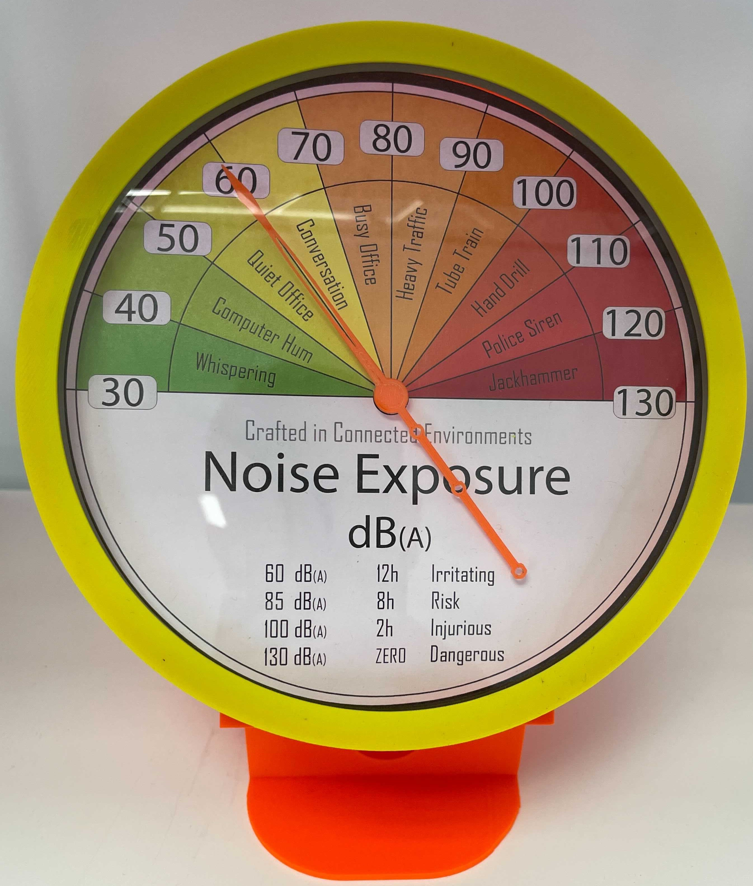
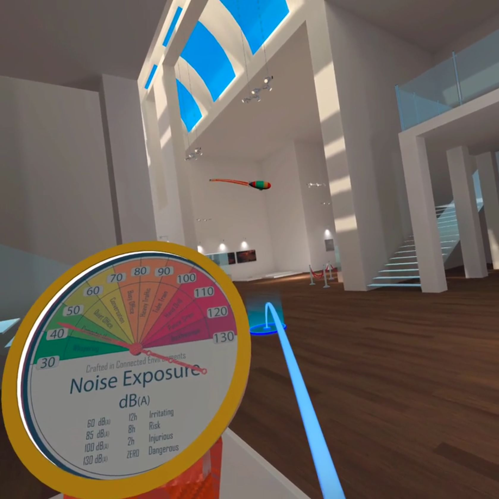

# Noise Exposure Gauge

### Data displayed

The Noise Exposure Gauge is used to visualise the real-time noise exposure expressed as Sound Pressure Level, LAeq dB(A). The range of values spans from 30dB(A) to 130dB(A). Each section of the dial scale provides a generic reference sound source that could be likely to be heard in, or nearby, the office environment.

## Data Source

Sound Level Meter [_Wensn WS1361_ over MQTT](https://github.com/ucl-casa-ce/wensn) located at CE Labs

## 3D printed model

### Hardware

- [Node MCU Arduino Board](http://www.nodemcu.com/index_en.html)
- MG90S Servo
- 2 LED Backlight Module – 38.7mm x 11.9mm x 2mm
- AC adapter 5.1V - 2.5A (same used for Rpi 3B+)
- 2 DuPont F-F cables
- 1 DuPont F-M cable

### Code and library

Using _ArduinoIDE_ 
Board: _NodeMCU 1.0 (ESP 12E Module)_
Code: [noiseGauge.ino](data/Arduino/noiseGauge.ino)

**Libraries used**

- ServoEasing - version 2.3.4
- PubSubClient - version 2.8.0
- NTPClient.h - version 3.2.0

### 3D printing settings and parts:

- Prusa MK3S - PLA - 0.2 mm Quality 15% infill
    - 00_NoiseGauge_TopCover.stl
    - 01_NoiseGauge_AcrylicHolder.stl
- Prusa MK3S - PLA - 0.3 mm Draft 15% infill
    - 04_NoiseGauge_GaugeBody_Lights.stl
    - 08_NoiseGauge_GaugeStand.stl
- Prusa MK3S - PLA Transparent - 0.1 mm 10% infill
    - 03_NoiseGauge_DialGraph.stl
- Prusa MK3S - PLA - 0.05 mm 15% infill
    - 02_NoiseGauge_DialGraphHolder.stl
    - 05_NoiseGauge_Spur Gear (14 teeth).stl
    - 06_NoiseGauge_Spur Gear (30 teeth).stl
    - 07_NoiseGauge_Pointer.stl
- Dial Graphic
    - [NoiseGauge_Dial.svg](data/3dprinter/NoiseGauge_Dial.svg)

## Digital model

- Blender: [Noise_Gauge_Blender.blend](data/3dmodel/Noise_Gauge_Blender.blend)
- GLB: [Noise_Gauge_Blender.glb](data/3dmodel/Noise_Gauge_Blender.glb)
- FBX: [Noise_Gauge_Blender.fbx](data/3dmodel/Noise_Gauge_Blender.fbx)

